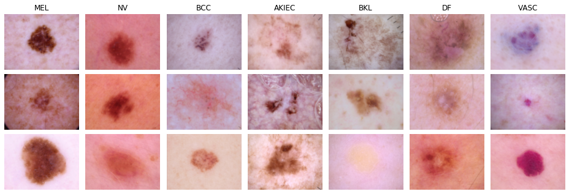

# ISIC 2018 Skin Lesion Classification Dataset

The _International Skin Imaging Collaboration (ISIC) 2018 Challenge_ comprises 10,015 dermoscopic skin lesion images, annotated with one of seven possible skin disease types.

Dataset homepage: <https://challenge.isic-archive.com/landing/2018/47>  
Paper: <https://arxiv.org/abs/1902.03368>

## Splits

The provided splits transform the seven-class classification problem into a two-class classification problem having limited data. More precisely, classes `MEL` and `BCC` are considered anomalous and the rest normal. The total number of training samples is 1000, roughly 1 order of magnitude smaller than the original size.
We down-sampled original classes according to the original training distribution.
Split `trainval2.txt` contains 134 images of mislabeled normal samples that are actually abnormal to simulate a noisy labeling scenario.
The number of mislabeled anomalous images corresponds to 16% of the numerosity of the normal training sample since anomalies were found to be 16% of the original training distribution.

|   Split    | Total Images | Anomalous Images |
|:---------- |-------------:|-----------------:|
| train1/2   |          750 |             123  |
| val1/2     |          250 |             41   |
| trainval1/2|         1000 |             164  |
| test       |         2124 |             800  |

## Usage

This dataset can be loaded using `small_data.datasets.ISIC2018Dataset`.
When using the `small_data.get_dataset` function, the respective dataset identifier is `"isic2018"`.
